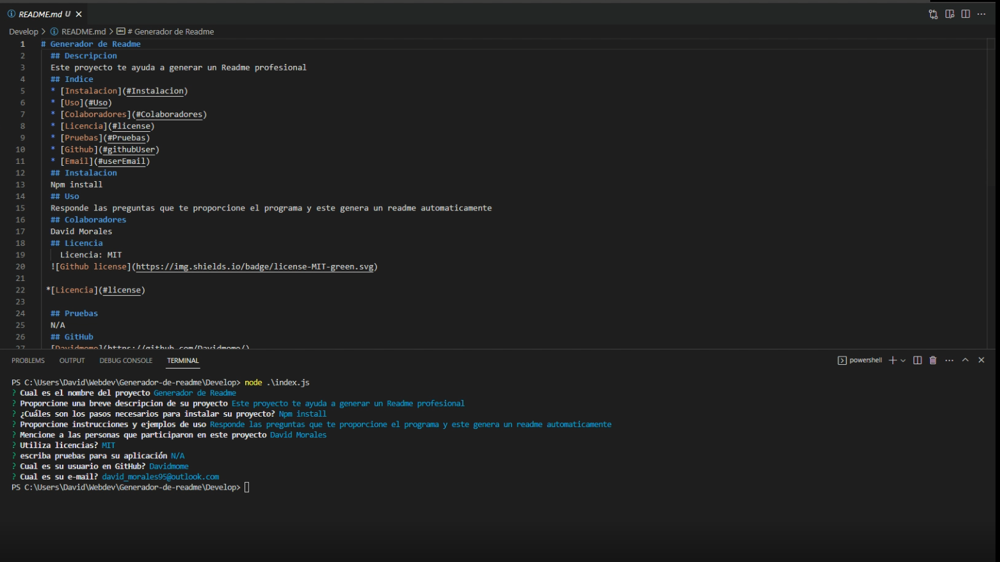

# Generador de Readme
  ## Descripcion
  Este proyecto te ayuda a generar un Readme profesional
  ## Indice
  * [Instalacion](#Instalacion)
  * [Uso](#Uso)
  * [Colaboradores](#Colaboradores)
  * [Licencia](#license)
  * [Pruebas](#Pruebas)
  * [Github](#githubUser)
  * [Email](#userEmail)
  ## Instalacion
  Npm install
  ## Uso
  Responde las preguntas que te proporcione el programa y este genera un readme automaticamente
  ## Demostracion
  
  [Email](https://drive.google.com/file/d/1FUkiPBf9WPliLmMFer-JWRq_K5o0R368/view)
  
  
  ## Colaboradores
  David Morales
  ## Licencia
    Licencia: MIT
  
  
 *[Licencia](#license)

  ## Pruebas
  N/A
  ## GitHub
  [Davidmome](https://github.com/Davidmome/)
  ## Email
  david_morales95@outlook.com
